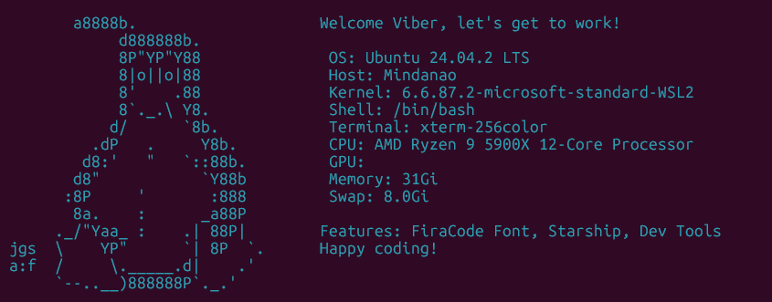

# 🚀 ConfigureWSL - Windows Subsystem for Linux Development Environment

[](https://github.com/yourusername/configure-wsl/actions/workflows/ci.yml)
[](https://github.com/yourusername/configure-wsl/actions/workflows/code-quality.yml)
[](https://www.powershellgallery.com/packages/ConfigureWSL)
[](https://www.powershellgallery.com/packages/ConfigureWSL)

[](https://github.com/PowerShell/PowerShell)
[](https://www.microsoft.com/windows)
[](https://docs.microsoft.com/en-us/windows/wsl/)
[](LICENSE)

A professional-grade PowerShell module that automatically sets up a fully configured WSL development environment with Ubuntu, Starship prompt, and FiraCode Nerd Font for an optimal coding experience in Windows Terminal and VS Code.



## ✨ Features

- 🐧 **Automated WSL & Ubuntu Installation** - Complete WSL setup with modern installation methods
- 🌟 **Starship Prompt** - Beautiful, minimal, blazing-fast cross-shell prompt
- 🔤 **FiraCode Nerd Font** - Programming ligatures and comprehensive icon support
- 🖥️ **Windows Terminal Configuration** - Automatic font and profile configuration
- 📝 **VS Code Integration** - Seamless editor font and terminal setup
- 📊 **Comprehensive Logging** - Detailed logging with multiple levels and file output
- 💾 **Automatic Backups** - Safe configuration changes with rollback capability
- 🛡️ **Robust Error Handling** - Graceful error recovery and user guidance
- 🧪 **Fully Tested** - Comprehensive unit and integration tests with >90% coverage
- 🚀 **CI/CD Pipeline** - Automated testing, quality checks, and releases

## 🚀 Quick Start

### PowerShell Gallery (Recommended)

```powershell
# Install the module
Install-Module -Name ConfigureWSL -Force

# Run the setup (as Administrator)
Install-WSLEnvironment
```

### Manual Installation

1. **Download the latest release** from [GitHub Releases](https://github.com/yourusername/configure-wsl/releases)
2. **Extract to PowerShell modules directory**
3. **Import and run**:
   ```powershell
   Import-Module ConfigureWSL
   Install-WSLEnvironment
   ```

### Legacy Script

The original standalone script is still available:

```powershell
# Run as Administrator
.\configure-wsl.ps1
```

## 📋 Prerequisites

- **Windows 10** version 2004 (build 19041) or later for WSL2
- **PowerShell 5.1** or later (PowerShell 7+ recommended)
- **Administrator privileges** for system modifications
- **Internet connection** for downloads

## 💻 Usage

### Basic Usage

```powershell
# Install with all default settings
Install-WSLEnvironment

# Skip font installation
Install-WSLEnvironment -SkipFontInstall

# Skip Starship prompt
Install-WSLEnvironment -SkipStarship

# Use custom Ubuntu version
Install-WSLEnvironment -DistroName "Ubuntu-22.04"

# Custom log location
Install-WSLEnvironment -LogPath "C:\Logs\wsl-setup.log"
```

### Advanced Usage

```powershell
# Import specific functions
Import-Module ConfigureWSL
Test-WSLInstallation
Install-FiraCodeFont
Update-WindowsTerminalConfig

# Check prerequisites
if (Test-Prerequisites) {
    Write-Host "System ready for WSL installation"
}

# Install components individually
Install-WSLDistribution -DistroName "Ubuntu"
Install-StarshipInWSL -DistroName "Ubuntu"
```

## 🎯 What Gets Installed

### Core Components

1. **WSL2 with Ubuntu** (or specified distribution)
2. **Starship Prompt** with shell integration
3. **FiraCode Nerd Font** with ligature support

### Automatic Configuration

- **Windows Terminal**: Font settings and profile optimization
- **Visual Studio Code**: Integrated terminal and editor fonts
- **WSL Environment**: Shell prompt and dependencies

### Supporting Features

- **Logging System**: Comprehensive installation tracking
- **Backup System**: Configuration file backups with restoration
- **Error Recovery**: Graceful handling of installation issues

## 📖 Module Functions

| Function                       | Description                             |
| ------------------------------ | --------------------------------------- |
| `Install-WSLEnvironment`       | Main orchestration function             |
| `Test-WSLInstallation`         | Check WSL installation status           |
| `Install-WSLDistribution`      | Install specific WSL distribution       |
| `Install-FiraCodeFont`         | Download and install FiraCode Nerd Font |
| `Install-StarshipInWSL`        | Install and configure Starship prompt   |
| `Update-WindowsTerminalConfig` | Configure Windows Terminal settings     |
| `Update-VSCodeConfig`          | Configure VS Code font settings         |
| `Test-Prerequisites`           | Validate system requirements            |
| `Test-IsAdministrator`         | Check administrator privileges          |

## 🧪 Testing

The module includes comprehensive testing with Pester:

```powershell
# Run all tests
.\tests\Invoke-Tests.ps1

# Run with code coverage
.\tests\Invoke-Tests.ps1 -Coverage

# Run in CI mode
.\tests\Invoke-Tests.ps1 -CI
```

### Test Coverage

- **Unit Tests**: Individual function testing with mocking
- **Integration Tests**: End-to-end workflow validation
- **Mock Tests**: External dependency simulation
- **Error Handling**: Exception and edge case testing

## 🔧 Development

### Setup Development Environment

```powershell
# Clone repository
git clone https://github.com/yourusername/configure-wsl.git
cd configure-wsl

# Install development dependencies
Install-Module -Name Pester -Force
Install-Module -Name PSScriptAnalyzer -Force

# Run tests
.\tests\Invoke-Tests.ps1 -Coverage
```

### Project Structure

```
configure-wsl/
├── .github/workflows/     # CI/CD pipelines
├── docs/                  # Documentation
├── src/                   # Source code
│   ├── ConfigureWSL.psd1  # Module manifest
│   └── ConfigureWSL.psm1  # Main module
├── tests/                 # Test suite
└── configure-wsl.ps1     # Legacy script
```

### Contributing

1. Fork the repository
2. Create a feature branch
3. Add tests for new functionality
4. Ensure all tests pass
5. Submit a pull request

See [DEVELOPMENT.md](docs/DEVELOPMENT.md) for detailed guidelines.

## 🚀 CI/CD Pipeline

### Automated Workflows

- **Continuous Integration**: Test on every commit and PR
- **Code Quality**: Static analysis and security scanning
- **Automated Releases**: Version management and publishing
- **Multi-Platform Testing**: Windows Server and Windows 10/11

### Quality Gates

- **Test Coverage**: >90% line coverage requirement
- **Code Analysis**: PSScriptAnalyzer validation
- **Security Scanning**: Vulnerability detection
- **Documentation**: Function help validation

## 🛠️ Troubleshooting

### Common Issues

#### WSL Installation Fails

```powershell
# Check WSL status
Test-WSLInstallation

# Manual WSL installation
wsl --install
# Restart computer, then run module again
```

#### Font Not Applied

- Restart Windows Terminal and VS Code
- Verify font installation: Check Windows Settings > Fonts
- Manually select "FiraCode Nerd Font" in application settings

#### Permission Errors

```powershell
# Verify administrator privileges
Test-IsAdministrator

# Run PowerShell as Administrator
Start-Process PowerShell -Verb RunAs
```

### Diagnostic Information

```powershell
# View installation logs
Get-Content "$env:TEMP\configure-wsl.log" -Tail 50

# Check module version
Get-Module ConfigureWSL | Select-Object Version

# Test system compatibility
Test-Prerequisites
```

## 📁 File Locations

- **Module Files**: `$env:PSModulePath\ConfigureWSL\`
- **Logs**: `$env:TEMP\configure-wsl.log`
- **Backups**: `$env:TEMP\wsl-config-backups-[timestamp]\`
- **Windows Terminal**: `$env:LOCALAPPDATA\Packages\Microsoft.WindowsTerminal_*\LocalState\`
- **VS Code Settings**: `$env:APPDATA\Code\User\settings.json`

## 🔄 Post-Installation

### Verification Steps

1. **Restart Applications**

   ```powershell
   # Close and reopen Windows Terminal
   # Restart VS Code
   ```

2. **Test WSL Environment**

   ```bash
   # In WSL terminal
   starship --version
   echo $PS1  # Should show Starship prompt
   ```

3. **Customize Configuration** (Optional)
   ```bash
   # Create Starship config
   mkdir -p ~/.config
   starship config > ~/.config/starship.toml
   ```

## 📚 Documentation

- **[Testing Guide](docs/TESTING.md)** - Comprehensive testing documentation
- **[CI/CD Guide](docs/CI-CD.md)** - Pipeline and automation details
- **[Development Guide](docs/DEVELOPMENT.md)** - Developer setup and guidelines

## 🤝 Contributing

We welcome contributions! Please see our [Contributing Guidelines](docs/DEVELOPMENT.md#contributing) for details.

### Ways to Contribute

- 🐛 **Report Bugs** - Submit detailed issue reports
- 💡 **Suggest Features** - Propose new functionality
- 📝 **Improve Documentation** - Help make docs clearer
- 🧪 **Add Tests** - Increase test coverage
- 🔧 **Submit Fixes** - Fix bugs and improve code

## 📊 Project Stats

- **Test Coverage**: >90%
- **PowerShell Versions**: 5.1, 7.0+
- **Windows Versions**: 10, 11, Server 2016+
- **CI/CD**: GitHub Actions
- **Code Quality**: PSScriptAnalyzer validated

## 📄 License

This project is licensed under the [MIT License](LICENSE) - see the LICENSE file for details.

## 🙏 Acknowledgments

- **[Starship](https://starship.rs/)** - The minimal, blazing-fast, and infinitely customizable prompt
- **[Nerd Fonts](https://www.nerdfonts.com/)** - Iconic font aggregator and patcher
- **[Microsoft WSL](https://docs.microsoft.com/en-us/windows/wsl/)** - Windows Subsystem for Linux
- **[Pester](https://pester.dev/)** - PowerShell testing framework
- **Community Contributors** - Thank you for your contributions and feedback!

---

**⭐ If this project helped you, please consider giving it a star on GitHub! ⭐**
